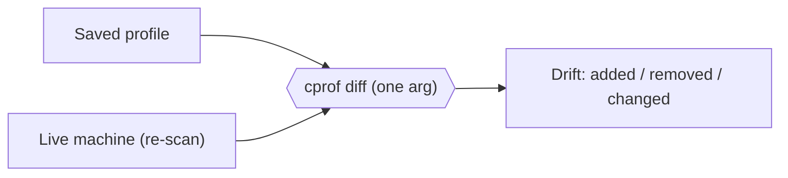

# Track drift

Saved a profile a while ago and wonder what you've changed since? Give `cprof diff` a
single profile and it re-scans your **current machine** and shows the difference — the
drift between the saved profile and your live setup.



## Check drift

```bash
cprof diff claude-profile.json
```

cprof re-scans the current machine using the profile's own scope and metadata (the same
way `refresh` does, so there's no name/version noise), then diffs the saved profile
against that live snapshot:

- `+` — something on the machine that isn't in the profile (added since you saved)
- `-` — something in the profile that's no longer on the machine (removed since you saved)
- `~` — a value that changed

A clean machine prints `No differences.` Drift is **not** an error — `cprof diff` exits
`0` either way (with `--json`, the `equal` field tells them apart).

## Drift vs. "what would install do"

`cprof diff <profile>` answers _"how has my machine changed vs the profile?"_. For the
inverse — _"what would applying this profile change?"_ — use
[`cprof install --dry-run`](../reference/commands.md#cprof-install), which prints the
write plan without touching anything.

## Comparing two files

The two-argument form is unchanged — compare any two profile files:

```bash
cprof diff a.json b.json
```

Secret-looking changed values are redacted in the output, and key order is ignored. See
the [`diff`](../reference/commands.md#cprof-diff) reference for both forms.
