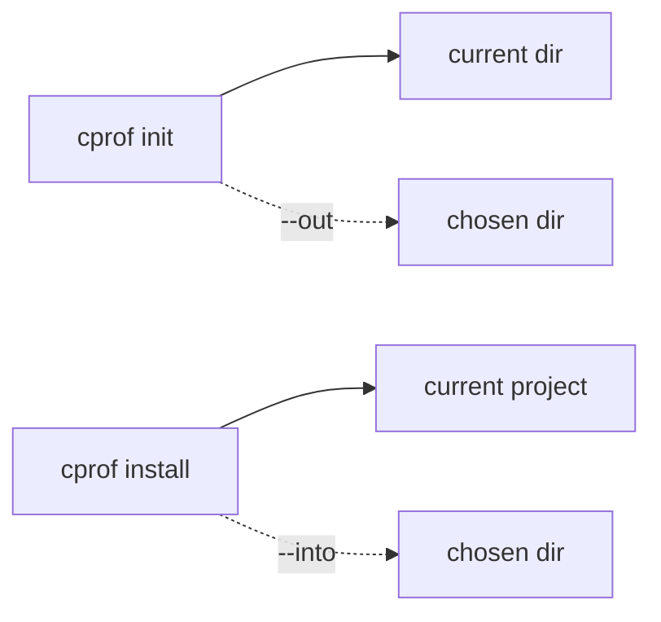

# Output locations & helper files

By default cprof writes into the current directory. A few flags redirect that and trim
the helper files cprof drops alongside a profile.



| Command         | Default                    | Redirect with |
| --------------- | -------------------------- | ------------- |
| `cprof init`    | the current directory      | `--out <dir>` |
| `cprof install` | the current project        | `--into <dir>`|

## Choose the output directory: `init --out`

```bash
cprof init --out ~/profiles/my-app
```

Writes `claude-profile.json` and its asset bundle into `~/profiles/my-app` (created if
missing) instead of the current directory — handy for dropping a profile straight into a
dotfiles repo. (Saving into `~/.cprof/templates/<name>` is exactly what
[`init --template`](./scaffold.md) does for you.)

## Choose the target: `install --into`

```bash
cprof install claude-profile.json --into ../fresh-app
```

Applies into `../fresh-app` instead of the current project. The profile is still read
from where you point it; only the _target_ changes. (`--global` content always targets
`~/.claude`, regardless of `--into`.)

## Skip the helper files

`cprof init` also writes a `.gitignore` and a `cprof-scan-report.txt` next to the
profile. Skip either (both also work on `cprof refresh`):

```bash
cprof init --no-gitignore   # don't write .gitignore
cprof init --no-report      # don't write cprof-scan-report.txt
```

**These never disable the secret leak-check** — that gate runs on every write
regardless; `--no-report` only drops the human-readable report file. See the
[`init`](../reference/commands.md#cprof-init) and
[`install`](../reference/commands.md#cprof-install) reference for these flags.
