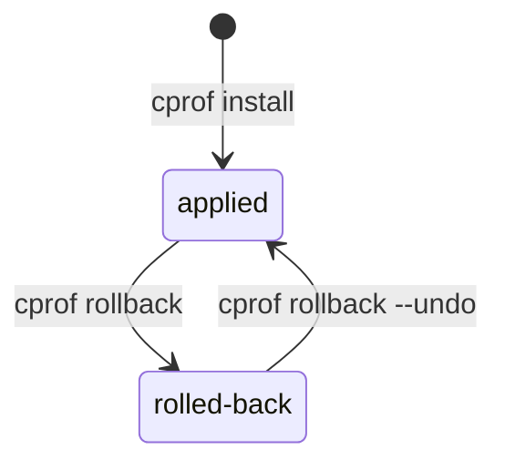

# Undo an install

`cprof install` backs up everything it replaces, so the last install is reversible.
`cprof rollback` undoes it; `cprof rollback --undo` re-applies it. It's a strict,
all-or-nothing toggle on the **most recent** install in a scope — not a time machine.



## Roll back the last install

```bash
cprof rollback
```

This restores every file the install merged or overwrote from its backup, and moves
files the install _created_ into a trash dir (`.cprof-trash/<timestamp>/`) — never a
hard delete. Preview it first with `--dry-run`.

## Re-apply it

Changed your mind? Re-apply the install you just rolled back:

```bash
cprof rollback --undo
```

Rollback stashes the post-install state before reverting, so `--undo` restores it
exactly. The ledger flips between `applied` and `rolled-back` each way.

## The change-guard

Before touching anything, rollback checks that every recorded file still matches the
state it expects. **If any file changed since the install, the whole operation aborts**
and names the offenders (exit `3`) — so an edit you've made since installing is never
silently clobbered. Override with `--force`:

```bash
cprof rollback --force
```

## Scope

By default rollback acts on the project ledger (`.cprof-state.json`); use `--global`
to act on the `~/.claude` ledger instead.

Exit codes: `0` done · `1` usage · `2` nothing to roll back · `3` aborted (a file
changed; use `--force`). See the [`rollback`](../reference/commands.md#cprof-rollback)
reference for the full flag list — and note a `cprof new --force` from the
[Scaffold a new project](./scaffold.md) guide is reversible the same way.
