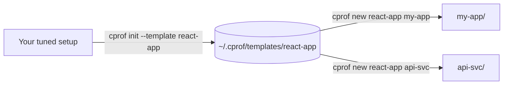

# Scaffold a new project

When you start a new project you usually want the same Claude Code setup you've
already tuned — your `CLAUDE.md`, skills, commands, and settings — without copying
files by hand. `cprof new` scaffolds a fresh project from a profile, and **named
templates** let you do it by name.

## The shape of it

Snapshot a good setup once as a named template, then scaffold as many projects from
it as you like:



## Save a template

From a project whose setup you want to reuse:

```bash
cprof init --template react-app
```

This captures the current setup (the same scan `cprof init` runs) and saves it as a
named template under `~/.cprof/templates/react-app/`. **Nothing is created
implicitly** — a template exists only when you ask for one with `--template`.

`--template` is mutually exclusive with `--out` (both choose where the bundle goes),
and it composes with `--global` / `--include-global` if you want to capture your
user-level setup as a template instead.

## Scaffold from a template

```bash
cprof new react-app my-app
```

This resolves `react-app` to `~/.cprof/templates/react-app/`, creates `my-app/` (the
directory is optional — it defaults to the current directory), and writes the
template's project content into it. List what you have:

```bash
cprof new --list
```

## Scaffold from a profile file

`cprof new` also takes a path, so you can scaffold from any `claude-profile.json` — a
bare name resolves as a template, anything path-like is treated as a path:

```bash
cprof new ./team-baseline/claude-profile.json my-app
```

## `new` vs `install`

`cprof new` is for a **fresh** project; [`cprof install`](../reference/commands.md#cprof-install)
is for an existing one.

- `new` **refuses to overwrite** anything that already exists and exits `1`, listing
  the collisions — pass `--force` to overwrite.
- A `--force` overwrite still keeps a backup, so
  [`cprof rollback`](../reference/commands.md#cprof-rollback) can reverse a scaffold.
- The clean path overwrites nothing and writes no backups.

Exit codes: `0` scaffolded · `1` usage or refused-overwrite · `2` profile or template
not found. See the [`new`](../reference/commands.md#cprof-new) and
[`init`](../reference/commands.md#cprof-init) reference for every flag.
